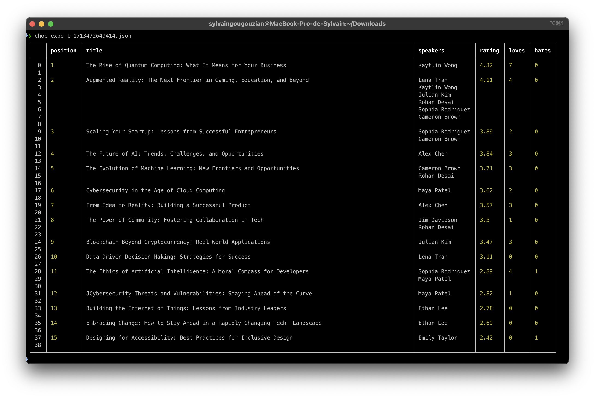
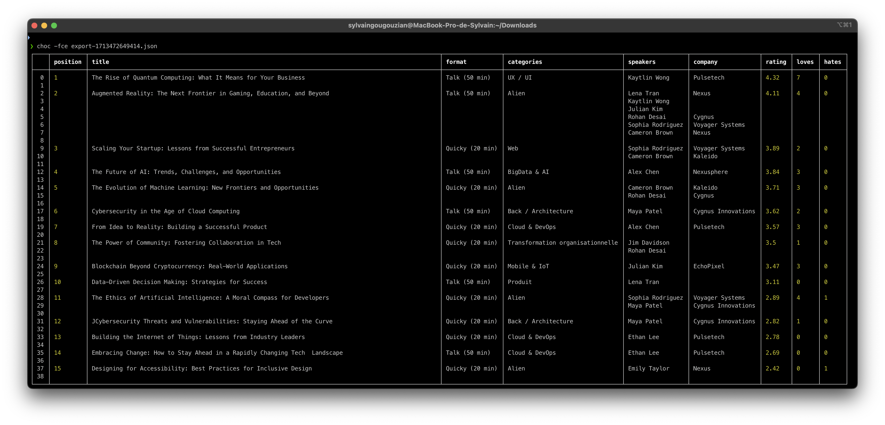

# CHOC

ConferenceHall Organization Companion

This tool takes your export.json and display a table into your terminal with the talks, speakers, ratings, ...

You can export into a TSV file too!

## Installation

### On MacOS

```
brew install gouz/tools/choc
```

### Other

In release, you can find a .deb or a ubuntu gzipped file.

## Usage

Export a json of your proposal:


```sh
choc -v

Usage: choc [options] <json>

ConferenceHall organization companion

Arguments:
  json                     the json export file

Options:
  -v, --version            output the version number
  -c, --with-categories    view categories (default: false)
  -f, --with-formats       view formats (default: false)
  -e, --with-companies     view speakers company (default: false)
  -a, --with-addresses     view speakers address (default: false)
  -l, --with-languages     view talks language (default: false)
  -t, --titlelength <int>  the title length (default: 100)
  -w, --links <eventId>    view links
  -x, --export <file>      export into tsv file
  -r, --render             render on a webpage (default: false)
  -h, --help               display help for command
```

### Default usage

```sh
choc export.json
```



### With options

```sh
choc -fce export.json
```



### Export to a tsv file 

Then you can import it into a spreadsheet

```sh
choc export.json -x export.tsv
```

### Web mode

**choc** is built with a webserver inside to transform you json into a nice webpage with filters.

```
choc export.json -r
```

You can add links to the talks with the `-w, --links`.

You need to write your event id, present in the URL in conference-hall.io .

```
choc export.json -rw 688i5iout
```

